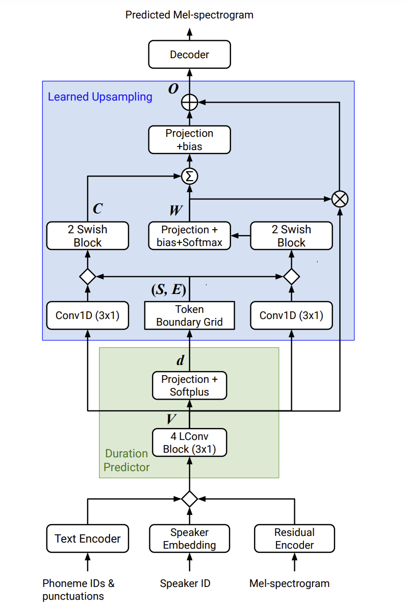

# Parallel-Tacotron-2
An unofficial implementation (Work-In-Progress)

Parallel Tacotron 2 is a non-autoregressive neural TTS model from Google.
Read the paper at [here](https://arxiv.org/abs/2103.14574).


Below is a block diagram of the model (cropped from the paper)




## Installation

To install, run the following command:

```sh
git clone https://github.com/NTT123/Parallel-Tacotron-2.git
cd Parallel-Tacotron-2
pip3 install -e .
```


## Prepare LJSpeech dataset

```sh
sudo apt-get install espeak-ng # phonemizer backend
pip3 install phonemizer # to convert text to phonemes
bash ./scripts/prepare_ljs_dataset.sh
```

The prepared dataset:

```
dataset/
├── LJSpeech-1.1
│   ├── filenames.txt
│   ├── metadata.csv
│   ├── phonemes.txt
│   ├── README
│   ├── transcript.txt
│   └── wavs
│       ├── LJ001-0001.wav
│       ├── LJ001-0002.wav
```

